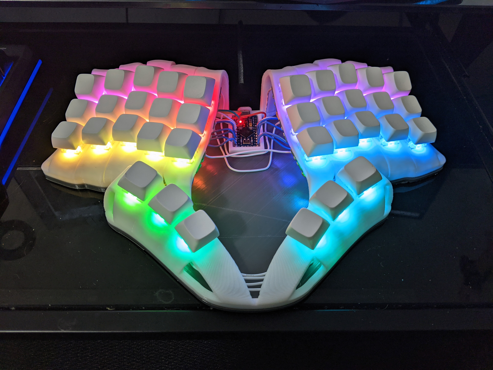
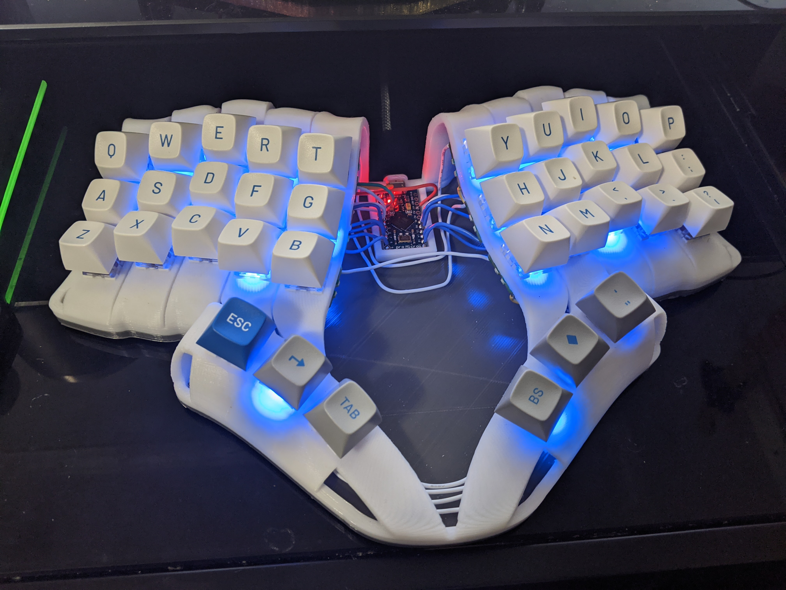
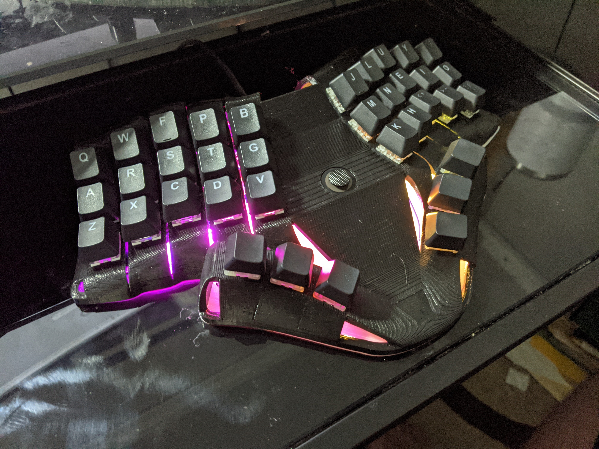

# enigma36
3D models for a hand wired keyboard

# Support me!

I have spent a lot of time and money designing prototypes, testing, developing, etc. Any contributions would be greatly appreciated!

If you don't want to, or can't afford to support me, please send me a message to let me know you've built one, along with pictures. Also, feel free to submit a pull request with pictures into this repository. I'd be happy to showcase your build.

Reddit: /u/sadekbaroudi
Discord: sadekbaroudi#1258

# Pictures

