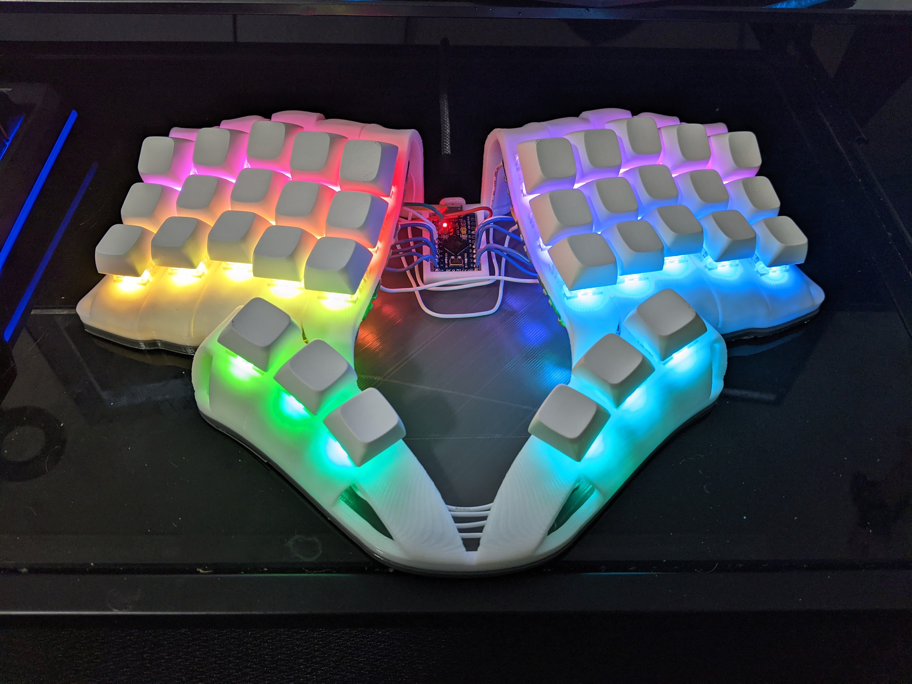
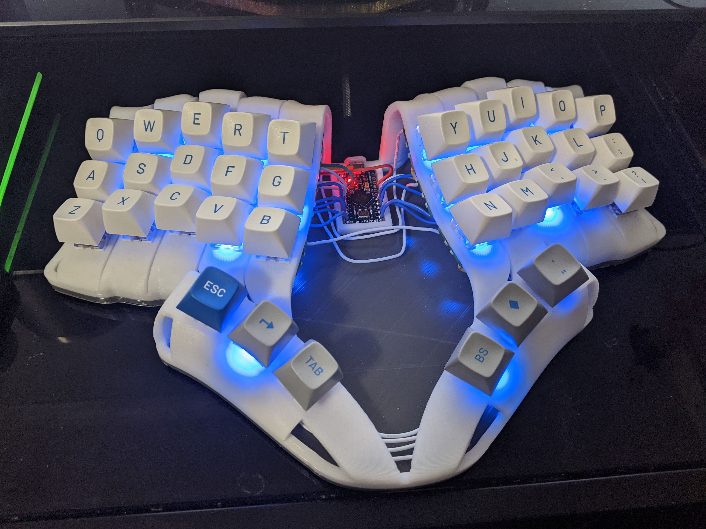

# enigma36 v1

# 3D Printing

You can print any of these models. Most settings will work fine. I used 0.3mm layers at 40 mm/s. You'll definitely need to use supports. I used the tree supports in Cura, and it printed like a charm.

Regarding the bottom plate, I recommend using the 5mm plate if you are using the open-center model. The open center is not as structurally sound without the support of a thick plate. If using the closed-center models, you can use the 1.6mm bottom plate.

# Assembly

The bodies have 4 spots where you can install heat set inserts. I used M2 X D3.0 X L3.6. You can go a little larger than 3.6mm in Length (L), but you should probably stick with the D3.0, since that's the diameter (D) of the holes in the little nubs on the inside of the body.

Use a soldering iron with the heat set insert attachment and press the insert into the 4 holes. This will allow you to screw 4 M2 screws into the bottom plate to secure it to the body.

Otherwise, you can hand wire it however you like. I used Amoeba Royales to make it cleaner for wiring, and to allow for the use of hot swap sockets and per key leds.

Note that the joystick version uses the PSP1000 joystick. You can buy these pretty readily. Then you can hot glue or screw it in, as it fits perfectly.

Look through the images directory for pictures of my first build assembly.

